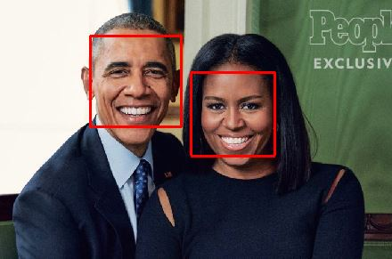
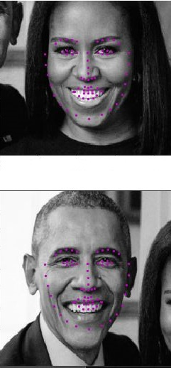

# Facial-Keypoint-Detection-using-cnn-opencv

#### Facial Keypoint Detection is the marking of important areas of the face i.e. the eyes, corners of the mouth, the nose, that are relevant for a variety of tasks, such as face filters, emotion recognition, pose recognition using convolutional neural network and computer vision techniques to perform facial keypoint detection.

Facial keypoints also called facial landmarks are the small magenta dots shown on each of the faces in the image above. In each training and test image, there is a single face and **68 keypoints, with coordinates (x, y), for that face**.  These keypoints mark important areas of the face: the eyes, corners of the mouth, the nose, etc. These keypoints are relevant for a variety of tasks, such as face filters, emotion recognition, pose recognition, and so on. Here they are, numbered, and you can see that specific ranges of points match different portions of the face.

### FACIAL KEYPOINT DETECTION

Running Facial Detection on image

Marked Facial Landmarks on the input image faces

